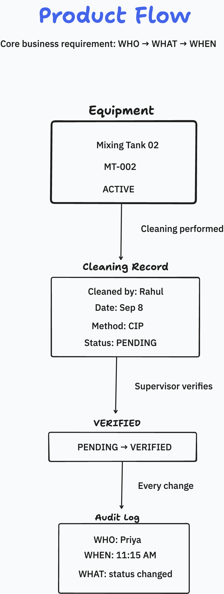
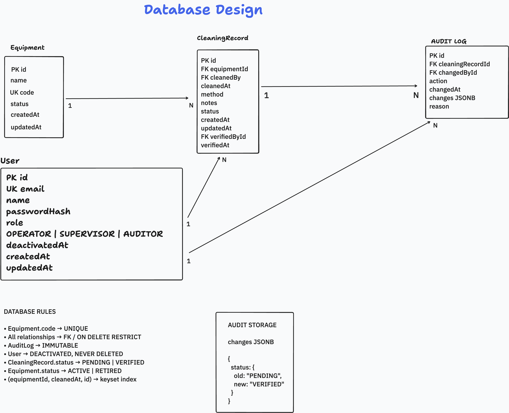
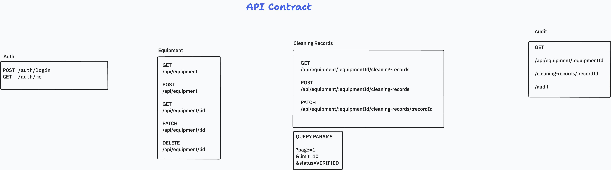
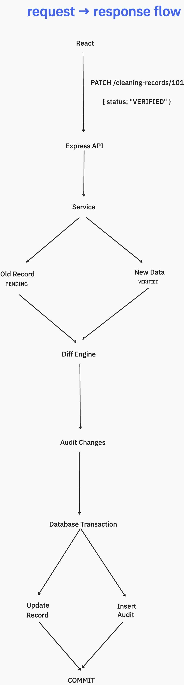

# Engineering Notes

This document captures the reasoning behind the implementation rather than repeating the
[README](./README.md), which covers setup and the API surface.

The brief looks like CRUD, but the thing actually being graded is the audit trail — and an audit
trail is only worth anything if it is *correct*, *complete*, and *hard to tamper with*. A trail that
is subtly wrong is worse than no trail, because people will trust it. So most of the design effort
went into three questions:

1. Can an entry ever record the wrong old value?
2. Can a change ever land without an entry?
3. Can anyone alter the trail after the fact?

Nearly every decision below follows from one of those. I prioritised correctness of that one
workflow over adding breadth to the product.

---

## Start here

**If you read nothing else, these are the six decisions I would want reviewed.** Each links to the
section that argues it.

| Decision | Why it matters |
|---|---|
| The audit actor is taken from the verified JWT, **never** the request body ([§4](#4-audit-trail-design)) | Otherwise the "who" in the trail is decoration a client can forge |
| The prior state is read **inside** a `SERIALIZABLE` transaction ([§4](#4-audit-trail-design)) | Under `READ COMMITTED`, two concurrent edits both log the same old value. Nothing errors — the trail is just quietly wrong |
| Immutability is a **database trigger**, not a convention ([§4](#4-audit-trail-design)) | "The application doesn't do that" does not survive a migration script or a `psql` prompt |
| Only changed fields are recorded, and a no-op writes nothing ([§4](#4-audit-trail-design)) | A trail padded with non-changes is harder to audit, not safer |
| Offset paging is the default; keyset exists and is **proven** by a paired test ([§5](#5-pagination-decision)) | Offset addresses a position and drifts under concurrent inserts; the test shows exactly which row repeats |
| A supervisor cannot verify a cleaning they performed ([§6](#6-authentication--authorization)) | Segregation of duties, enforced in the API — the hidden button is only a convenience |

**The three files worth opening:**

| File | Why |
|---|---|
| `apps/api/src/domain/audit/diff.ts` | The diff engine. Pure function, no Prisma or clock, exhaustively tested |
| `apps/api/src/modules/cleaning-records/cleaning-record.service.ts` | Where the transaction, the isolation level and the business rules meet |
| `apps/api/test/integration/audit.test.ts` | Forces the audit insert to fail inside the database and asserts the record is unchanged |

The four diagrams below cover the same ground visually. Everything after them is the reasoning,
roughly in the order the brief asks for it.

---


## The system at a glance

Four diagrams, drawn while designing it. The code is the source of truth; each links to a page with
more detail.

### Product flow



Equipment → cleaning event → verification → audit trail. Every change, including the verification
itself, lands in the trail. More: [product flow](./docs/01-product-flow.md).

### Database design



Note the two separate references from `User` into a cleaning record — who *performed* it and who
*signed it off* — and a third from the audit log for who *edited* the row. Those being different
people is the point of the model. More: [database design](./docs/02-database-design.md).

### API contract



The core surface. The supporting routes — the two cross-equipment reads, account provisioning,
dashboard and health — are listed in [API contract](./docs/03-api-contract.md).

### Request → response



The transaction opens *before* the prior state is read, at `SERIALIZABLE`, and the record update and
audit insert commit together or not at all. That ordering is the whole defence described in
[§4](#4-audit-trail-design). More: [request/response flow](./docs/04-request-response-flow.md).

---

## 1. Product interpretation

I treated the assignment as a slice of a larger pharmaceutical manufacturing system rather than as a
CRUD exercise. The workflow I modelled:

**Equipment → Cleaning Event → Verification → Audit Trail**

An operator records that an asset was cleaned. A supervisor verifies it. Every creation and
modification lands in an immutable trail, so the system can answer: what changed, who changed it,
when, from what value, to what value.

The relationship is strictly hierarchical:

```text
Equipment
   └── 1:N CleaningRecord
              └── 1:N AuditLog
```

A cleaning record never exists without an equipment association, and an audit entry always belongs
to the record whose history it describes. The UI follows the same mental model — equipment → its
cleanings → one cleaning → its history — so the navigation teaches the data model.

I kept this explicit rather than building a generic activity/event table, because the brief's audit
requirement is specifically about changes to cleaning records. A generic event log would have been
more "flexible" and less able to answer the actual question.

Diagrams: [product flow](./docs/01-product-flow.md).

---


## 2. Requirements → implementation


| Requirement           | Implementation                                                  |
| --------------------- | --------------------------------------------------------------- |
| Equipment CRUD        | Equipment module; `DELETE` refuses when history exists (§8)     |
| Cleaning record CRUD  | Cleaning-records module, nested under equipment                 |
| Pagination            | Offset (default) + keyset, both server-side (§5)                |
| Status filtering      | Query parameter, validated server-side with a shared Zod schema |
| Audit trail           | Field-level diff stored as JSONB (§4)                           |
| Audit actor           | Derived from the verified JWT, never the request body           |
| Atomic audit          | Record update + audit insert in one `SERIALIZABLE` transaction  |
| Audit immutability    | PostgreSQL trigger rejects `UPDATE`/`DELETE`                    |
| Authentication        | JWT, bcrypt-hashed passwords                                    |
| Authorization         | Operator / Supervisor / Auditor, with segregation of duties     |
| Validation            | Zod schemas in `packages/shared`, used by both apps             |
| Tests                 | 77 — 21 unit, 56 integration against real PostgreSQL            |
| Local reproducibility | Docker Compose, or local PostgreSQL                             |
| Deployment            | Vercel (web) + Render (API) + Neon (PostgreSQL)                 |


Extra features were added only where they strengthened this core workflow rather than widening it.

---


## 3. Architecture decisions

```text
React → REST → middleware → route → service → Prisma → PostgreSQL
```

**Business logic stays out of Express.** Routes handle HTTP concerns: read params/query/body, call
the service, return a response. Services own domain behaviour — authorization-sensitive operations,
diff generation, transactions, pagination, business rules.

The rule that enforces it: **Express** `req`**/**`res` **types never enter a service.** Services take plain
arguments and return plain data. That is what makes the audit and pagination logic testable without
constructing an HTTP request, and it is why the diff engine lives in `domain/` rather than inside
the service that calls it.

`buildApp()` **is separate from** `listen()`**.** `src/app.ts` returns the configured app;
`src/server.ts` owns the port and graceful shutdown. Supertest drives the app in-process with no
network, and the same separation is what would make a serverless adaptation possible if it were ever
wanted.

**Prisma over raw SQL** — typed queries, migrations as reviewable committed SQL, and a transaction
API with an explicit isolation level.

What it costs: the keyset predicate cannot be expressed as PostgreSQL's row-value comparison
`(cleaned_at, id) < (:a, :b)`. Prisma builds the logically equivalent
`cleaned_at < :a OR (cleaned_at = :a AND id < :b)`. The planner handles it with the composite index,
but the row-value form is tighter, and in raw SQL I would have written that. Where raw SQL was
clearly right — the immutability trigger — it is a hand-written migration.

**A pnpm workspace with three packages** so the Zod schemas can be imported by both apps.
`packages/shared` is source-only: its `exports` points at `./src/index.ts`, so there is no build step
and no watcher.

Diagrams: [API contract](./docs/03-api-contract.md), [request/response flow](./docs/04-request-response-flow.md).

---


## 4. Audit trail design

The most important design problem in the assignment.

### The actor is never client-supplied

A naive implementation accepts `{ "changedBy": "Priya", "changes": { … } }` from the client. The
client does not get to decide who performed a change.

```text
JWT → authenticate middleware → req.user → service → audit.changedById
```

There is deliberately no code path that lets a request body nominate the actor, and a test sends a
`changedById` in the body to assert it is ignored.

`cleanedById` **(the subject) is a different person from** `changedById` **(the actor).** The brief's
`cleanedBy` conflates them. An operator can file a record for a cleaning a colleague performed; a
supervisor can fix a typo on someone else's record. A regulator cares about both and about telling
them apart. `cleanedById` is chosen in the form and is itself an audited field.

### The diff engine is a pure function

`apps/api/src/domain/audit/diff.ts` takes plain objects and returns a change set. No Prisma, no
Express, no clock — which is what makes it exhaustively testable. Three subtleties it exists to get
right:

- `undefined` **is not** `null`**.** On a `PATCH`, `{}` means "change nothing" and `{ notes: null }`
means "erase the notes". Conflating them would let an empty request body wipe a record *and record
it as though that were intended*.
- **Dates compare by value.** Two `Date` objects for the same instant are `!==`. Comparing by
reference would log a spurious `cleanedAt` transition on every single update.
- **The field list is an allow-list**, not "every key on the object". This keeps `id`/`createdAt` out
of the trail and stops a caller smuggling an arbitrary key in via the request body.


### Only changed fields, and a no-op writes nothing

Given `status: PENDING → VERIFIED` with `notes` resent unchanged, the entry contains only:

```json
{ "status": { "old": "PENDING", "new": "VERIFIED" } }
```

An entry containing `notes: { old: "x", new: "x" }` is noise, and a trail padded with "user opened
the form and pressed save" is harder for an auditor to read, not safer. An empty change set still
returns `200` — it just adds nothing.

This is a judgement call and it is arguable. Someone could reasonably want a record of *attempted*
saves. I would want that as a separate access log, not mixed into the change history.

### `SERIALIZABLE`, and why it is not paranoia

The record and its audit entry are written in one transaction — otherwise a failed audit insert
leaves an untraceable change.

Less obviously, **the read of the prior state also happens inside that transaction**. Under the
default `READ COMMITTED`, two concurrent `PATCH`es could each read the same `before` row and each
write an entry claiming the same old value. Nothing would error. The record would end up correct and
the trail would be quietly, plausibly wrong — the worst possible outcome for this system.

PostgreSQL aborts one transaction instead. Prisma surfaces `P2034`; the error handler maps it to
`409 WRITE_CONFLICT`.

The cost is real: reduced write throughput and retryable failures for concurrent edits of the *same
record*. For a cleaning log — a handful of writes per record, ever — that is free. On a hot table it
would need revisiting, probably via optimistic concurrency on a version column.

### Immutability belongs in the database

`audit_logs` has a trigger that raises on `UPDATE` and `DELETE`. The application never issues
either — but "the application does not do that" is a convention, and conventions do not survive a
future developer, a migration script, or somebody at a `psql` prompt. In a regulated context the
guarantee belongs where it cannot be bypassed.

**Deliberate gap:** `TRUNCATE` still works, because it does not fire row-level triggers and both the
seed and the test suite need to reset the database. It requires table ownership, so it stays an
administrative act rather than something application code can reach. The stronger answer is a
least-privilege role with `INSERT`/`SELECT` only — see §14.

*Verified on the deployed database, not just locally:* `UPDATE` *and* `DELETE` *against* `audit_logs` *on
Neon both fail with "audit_logs is append-only".*

---


## 5. Pagination decision

Both modes are implemented; **offset is the default.**

**Why offset is the default:** the UI shows numbered pages and "showing 11–20 of 28", which needs a
total count. Keyset cannot provide one without a separate `COUNT`, at which point its main advantage
is gone. For a per-asset cleaning history — tens to low thousands of rows — offset's deep-page cost
never materialises.

**Why keyset exists anyway:** offset addresses a *position*. Insert a row ahead of the reader between
two page requests and everything shifts, so the reader sees an item twice (and on deletion, misses
one). Keyset addresses a *value*, so it cannot happen. A paired test demonstrates exactly this: same
insertion, offset repeats a specific known row, keyset returns the correct next slice.

Two details worth pointing at:

- **The order is** `(cleanedAt DESC, id DESC)`**, not** `cleanedAt` **alone.** Two cleanings can share a
timestamp; without the tie-breaker the order is not total and keyset drops rows. This is also why
Prisma's built-in `cursor` option was not used — it seeks on a single unique column and cannot
express "same timestamp, smaller id". There is a test with six records sharing one timestamp.
- **The cursor is base64url of** `{ cleanedAt, id }` **and is not signed.** It encodes only values the
caller can already see in the response, so signing would protect nothing. It *is* schema-validated
on the way in, so a tampered cursor yields `400` rather than a crash or a strange query.

`limit` is **clamped** to 100 rather than rejected — a client asking for 10 000 gets 100, not an
error it has to handle.

The global audit endpoint and the user-admin listing are offset-only: both are bounded reports a
reviewer pages through with a known total, not feeds needing concurrent-insert stability.

---


## 6. Authentication & authorization

Real JWT auth: bcrypt-hashed passwords, `POST /auth/login` issues an 8-hour token, middleware puts
`req.user` on every request. The audit actor is the authenticated principal — without this the "who"
in the trail is decoration.

Three roles, and two rules that are more than decoration:

- Only a `SUPERVISOR` can move a record `PENDING → VERIFIED`.
- **A supervisor cannot verify a cleaning they are recorded as having performed.** Segregation of
duties. The UI hides the button *and* the API refuses it, because a UI check is a convenience, not
a control.

Amending an already-verified record requires a stated `reason`, stored on the audit entry rather
than on the record.

**Login does not leak account existence.** An unknown email is compared against a dummy hash so that
a wrong password and an unregistered address take the same time and return an identical response —
otherwise the endpoint doubles as an email-enumeration oracle.

**Trade-offs taken knowingly:**

- The identity is reconstructed from the token's claims rather than re-read from the database each
request. Stateless and cheap, but a role change does not take effect until the token expires.
- The token is kept in `localStorage`, which is XSS-readable. An httpOnly cookie plus CSRF
protection is the better answer for a real deployment; it was not worth the extra moving parts
here.
- No refresh-token rotation, revocation list, password reset, email verification, OAuth or rate
limiting on login. Those add infrastructure without improving what the brief asks for.

**There is deliberately no signup route.** Accounts are provisioned by a supervisor
(`POST /api/users`, and `/app/settings/users` in the UI). Self-registration would let anyone mint the
identity that then appears in the trail's "who" column, which undermines the one property the system
exists to provide. The absence is a decision, not an omission — so the sign-in page says so out loud.

---


## 7. Database decisions

Full ERD and index rationale: [database design](./docs/02-database-design.md).

`changes` **is JSONB, not a column per field.** Different updates touch different fields; the
alternative (`old_status`/`new_status`/`old_notes`/…) needs a migration every time the record gains a
field and leaves most columns null on most rows. The cost is that the trail is not statically typed
at the database level and "show me every status transition" needs a JSON operator. That is the right
trade — PostgreSQL indexes JSONB perfectly well if that query ever matters, and the schema stays
stable as the domain grows. Values are normalised to JSON scalars (dates to ISO strings, `undefined`
to `null`) before storage.

**UUIDv7 primary keys.** Time-sortable, so `(cleanedAt, id)` is a usable total order for keyset
pagination, while ids stay opaque in URLs. Auto-increment integers would leak how many records exist
and make ids guessable; UUIDv4 would give up the sortable tie-breaker.

`onDelete: Restrict` **everywhere, no cascades.** Deleting equipment must not silently take its
cleaning history; deleting a record must not take its audit trail. Cascades are convenient and
exactly wrong here. Users are **deactivated**, never deleted, for the same reason: their id is
referenced by rows whose subject must not disappear.

**snake_case tables, camelCase in code** via `@@map`/`@map`. It keeps the hand-written SQL — the
trigger, the test truncation — free of quoted identifiers.

**Prisma 7 specifics**, since they are recent enough to surprise: `url` is gone from the schema
datasource (Migrate reads `prisma.config.ts`; the runtime connects through `@prisma/adapter-pg`),
`.env` is no longer auto-loaded, `migrate dev` no longer generates the client, `migrate reset` no
longer runs the seed, and the `prisma` CLI's `latest` npm tag currently points at an `8.0.0-rc`
while `@prisma/client@latest` is `7.10.0` — so it is pinned. Each of those failed *silently* rather
than loudly; see §13.

---


## 8. API design

**Nested routes where the relationship is real** —
`/api/equipment/:equipmentId/cleaning-records/:recordId`. A cleaning record has no meaning detached
from the asset it describes. The handler verifies the record actually belongs to that equipment and
returns `404` otherwise, so a record cannot be read through the wrong parent.

Two **flat** routes exist because they answer questions a per-asset drill-down structurally cannot:
`GET /api/cleaning-records` ("every CIP cleaning last week") and `GET /api/audit` ("everything Priya
changed, everywhere").

**One error shape**, from a single handler, with a machine-readable `code` and optional per-field
`details` so a form can highlight the offending input rather than showing a detached banner.
Prisma's `P2002`/`P2025`/`P2003`/`P2034` are mapped to domain errors so the client never sees a
database-shaped failure. Extracting the conflicting field from `P2002` needs care on Prisma 7: with a
driver adapter the old `meta.target` is gone and the constraint name arrives instead, so both shapes
are handled.

**Express 5** forwards rejected promises from async handlers to the error handler automatically,
which is why no route in this codebase wraps itself in `try/catch`. Validated input goes on
`req.validatedBody`/`req.validatedQuery` — Express 5 makes `query` getter-only.

### Two domain rules that bend the brief

`DELETE /api/equipment/:id` **refuses when cleaning history exists** (`409`, pointing at
`PATCH { status: "RETIRED" }`). The brief says "CRUD for equipment"; this is a literal reading bent
slightly. Destroying cleaning history to tidy up an asset list is precisely what a regulated system
must not permit. Delete still works for equipment with no history, so the "D" is genuinely there.
Happy to change it if a plain hard delete was the intent.

**A record always starts** `PENDING`**.** `status` is not accepted on create — a client-supplied
`"VERIFIED"` is ignored, with a test to prove it. Letting the author self-declare a record verified
would defeat the two-person rule the field exists to express.

---


## 9. Frontend decisions

**Shared Zod schemas.** `packages/shared` is imported by both apps, and React Hook Form resolves
against the exact schema the API validates with — one definition of "a valid cleaning record",
including the "not in the future" rule. The server stays authoritative; the shared schema exists to
stop the two contracts drifting.

**TanStack Query** for server state. After a mutation, the per-asset list, that record's trail, the
cross-equipment list, the compliance trail *and* the dashboard counters are all invalidated. The
first version invalidated only the per-asset keys, and because `staleTime` is 30s with no refetch on
focus, verifying a record left three other views showing the pre-write value with no visible reason.

**Four states everywhere** — loading, empty, error-with-retry, data — as shared components, so
"loading" cannot silently become a blank screen in one place and a spinner in another.

**URL as state.** Page, filters and pagination mode live in the query string, so a view can be
linked and survives a refresh. The one exception is the equipment search box, which is driven by
local state with the *debounced* value reaching the query and the URL: syncing the URL back into the
input races the debounce, and a keystroke landing between the write and the sync gets overwritten by
the older value, silently eating characters.

**Debounced search.** Typing "Mixing Tank" fired eleven requests, ten of them thrown away. Now one.

### The design passes

The functional build looked like scaffolding; two later passes fixed that. The detail — a
colourblind-unsafe chart palette caught by a validator, deleting shadcn's sidebar rather than
fighting it, two Three.js scenes using different techniques, and the line I would not cross on
fabricated numbers — is in **[docs/design-pass.md](./docs/design-pass.md)**, deliberately out of
this document so it does not compete with the audit reasoning.

## 10. Testing strategy

**77 tests: 21 unit, 56 integration.**

**Unit** — pure logic with no database: the diff engine (unchanged fields, `null` → value, value →
`null`, `undefined` ≠ `null`, date-by-value), cursor encoding/decoding, pagination arithmetic. Runs
in ~150ms.

**Integration** — supertest against a **real PostgreSQL database, not a mocked Prisma client**. The
three things most worth testing here — transaction rollback, the immutability trigger, keyset
ordering under ties — do not exist in a mock. A mocked suite would be self-congratulatory.
`globalSetup` applies migrations once; `setupFiles` truncates every table before each test;
`fileParallelism` is off because the database is shared.

Two tests I would point a reviewer at:

- **Rollback on audit failure.** It installs a temporary trigger that makes the audit insert throw,
issues a real `PATCH`, and asserts the record is unchanged and no entry was written. Forcing the
failure *inside the database* exercises the transaction for real.
- **Offset drift vs keyset stability.** The same scenario run twice: offset repeats a specific known
row, keyset returns exactly the two rows that genuinely follow. It asserts *which* row repeats, not
merely that some overlap exists, so it cannot pass vacuously.

The goal was not to maximise test count but to cover the failure modes most likely to make the system
quietly wrong.

**Not covered: there are no front-end tests.** Given the time budget I put the effort into the audit
and pagination logic, which is where correctness lives and what the brief singles out. The UI *was*
verified end-to-end via a headless browser throughout development — sign-in, both pagination modes,
filtering, a live verify updating the trail — but that was a check, not a committed test. First
additions would be the audit timeline's `old → new` rendering, the debounced search, and the date
picker's timezone handling.

---


## 11. Docker & deployment

**Locally**, `docker-compose.yml` brings up PostgreSQL 17 so a reviewer needs one command and no
local database. A local PostgreSQL works equally well; the README documents both.

**Deployed** as three free tiers, one per concern:


| Piece      | Host                                         |
| ---------- | -------------------------------------------- |
| PostgreSQL | Neon (AWS us-east-2)                         |
| API        | Render web service (`render.yaml` blueprint) |
| Web        | Vercel                                       |


**The API is deployed as a long-running process, not serverless functions.** It keeps a real `pg`
connection pool, writes inside `SERIALIZABLE` transactions, and owns a graceful-shutdown path. On a
function runtime each invocation would open its own pool and need PgBouncer in front of exactly
those transactions — the wrong trade. `buildApp()`/`listen()` are separate, so a serverless
adaptation is *possible*; it just is not the right default here.

Three things this took to get right, all of which failed in ways that looked like something else:

- **Neon's two connection strings are not interchangeable.** Migrations use the **direct** string
because `prisma migrate` takes advisory locks, which transaction pooling cannot hold. The running
API uses the `-pooler` string, because Neon's free compute suspends when idle and a direct pool
hands the next request a dead socket; PgBouncer absorbs the reconnect instead. Transaction pooling
keeps a whole transaction on one server connection, so `SERIALIZABLE` is unaffected.
- `VITE_API_URL` **is inlined at build time.** Setting it after the first deploy leaves the previous
bundle pointing at `localhost:4000`, so every visitor's browser calls their own machine. It needs a
rebuild, not just a variable.
- `CORS_ORIGIN` **must be a bare origin.** A value copied from the address bar carries a trailing
slash, and a browser's `Origin` header never does — so it matches nothing. The failure is
invisible from the server side: every request still returns 200 to `curl` while the browser
silently drops the response for want of an `Access-Control-Allow-Origin` header. Diagnosed by
diffing the preflight headers for both spellings.

**Node 24 is pinned** in `.nvmrc` and `.node-version`, because the root `package.json` allows `>=20`
while Prisma 7 rejects odd-numbered majors with a confusing preinstall failure.

---


## 12. What I intentionally did not build

The assignment is scoped as a few hours' work, so I avoided turning it into a production ERP.


| Left out                                                                | Why                                                                                                                                                                                                       |
| ----------------------------------------------------------------------- | --------------------------------------------------------------------------------------------------------------------------------------------------------------------------------------------------------- |
| Electronic signatures (21 CFR Part 11)                                  | Meaning-of-signature, re-authentication at signing, signature manifestations. Real requirements for this domain, well beyond the brief.                                                                   |
| Audit trail for `Equipment`                                             | The brief specifies auditing cleaning records. The diff engine is generic and would extend to it, but I did not want to imply scope that was not asked for.                                               |
| Audit trail for account provisioning                                    | `audit_logs` is scoped to cleaning records by design; folding a second, unrelated audit domain into the same table would muddy every query against it. A real system wants a separate security-event log. |
| Audit export / compliance reports                                       | An auditor eventually wants a signed PDF or CSV, not a web panel.                                                                                                                                         |
| Soft deletes and record versioning                                      | The audit trail already reconstructs history; a second mechanism would be redundant.                                                                                                                      |
| Barcode/QR scanning, batch management, SOP documents, photo attachments | Natural next steps for a real product, unnecessary to demonstrate the requested slice.                                                                                                                    |
| Approval workflows beyond verification                                  | The two-person rule is the part the brief actually asks about.                                                                                                                                            |
| Notifications / email infrastructure                                    | Infrastructure without insight.                                                                                                                                                                           |
| Multi-tenancy                                                           | A different architecture, not a feature.                                                                                                                                                                  |
| Front-end tests                                                         | §10.                                                                                                                                                                                                      |
| Dark mode                                                               | A compliance tool read for hours wants the contrast dense tables need. Dark-mode tokens exist (inherited from shadcn) but are untuned.                                                                    |
| i18n, timezone selection                                                | Timestamps render in the viewer's locale via `Intl`. A real plant needs an explicit site timezone.                                                                                                        |


---


## 13. Known limitations

**Demo authentication.** The seeded users share one known password because this is a take-home. It
would obviously never ship.

**Shared demo database.** The deployed demo is one seeded database, so changes made by one reviewer
are visible to the next — and because `audit_logs` is append-only by design, nothing anyone does can
be tidied away row-by-row. Re-running the seed is the only reset, and it truncates. A real demo
environment would be per-session or reset on a schedule.

**Free-tier cold starts.** The API sleeps after ~15 minutes idle and takes ~30–60s to wake. The
sign-in form explains itself if a request passes four seconds, because a silent spinner reads as a
broken app rather than a waking one. The architecture is the same as a persistent deployment; only
the tier is free.

**The composite index is unproven, not unverified.** It is right in principle, but at ~70 seeded rows
the planner will sequential-scan regardless. I would want `EXPLAIN ANALYZE` at a few hundred thousand
rows before claiming it works.

`TRUNCATE` **bypasses the immutability trigger** (§4) — mitigated by table ownership, properly fixed
by a least-privilege role.

**Role changes are not immediate** — the identity comes from token claims, so a change takes effect
when the 8-hour token expires.

**No front-end tests** (§10).

**Prisma 7's silent failures cost real time.** `migrate dev` no longer generates the client and
`migrate reset` no longer runs the seed; both exit cleanly while leaving you broken. Found by cloning
the repository into a clean directory and following the README literally — worth doing before
submitting anything, because the machine you built on always has state a reviewer's does not.

---


## 14. Future production considerations

In rough order of what I would do next:

1. **Retry** `P2034` **server-side** once or twice with a short backoff before surfacing a 409. Right now
  the burden is on the client.
2. **A least-privilege database role** — `INSERT`/`SELECT` only on `audit_logs`. Stronger than the
  trigger and it closes the `TRUNCATE` gap.
3. **Move the token out of** `localStorage` to an httpOnly cookie with CSRF protection.
4. **A generic** `auditable` **service wrapper** so a second entity gets a trail by configuration rather
  than by copying the transaction block.
5. **Front-end tests**, starting with the audit timeline.
6. `EXPLAIN ANALYZE` **the keyset query at scale.**
7. **Per-route code-splitting** inside the authenticated app.

Beyond that, and genuinely outside this scope: a real identity provider / SSO, electronic-signature
semantics, audit retention policies, backups and point-in-time recovery, structured logging, metrics
and tracing, rate limiting, secrets management, CI-run migrations, and more granular authorization
policies.

---
