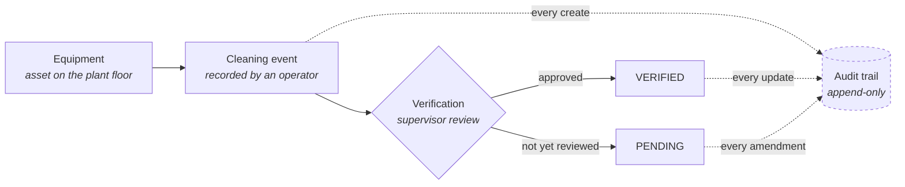
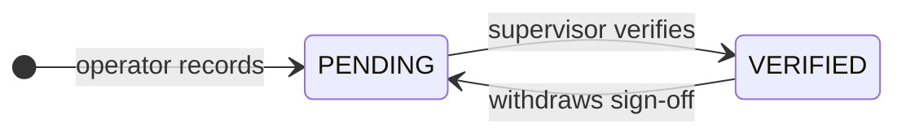
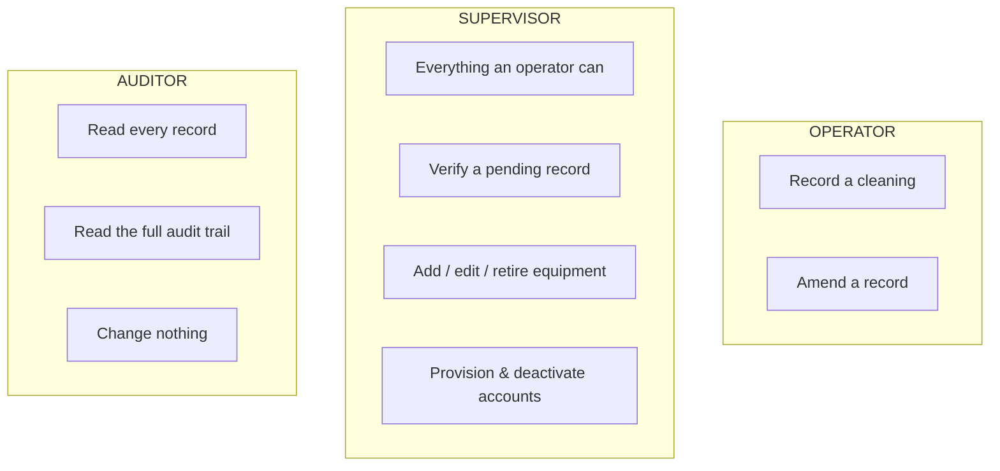
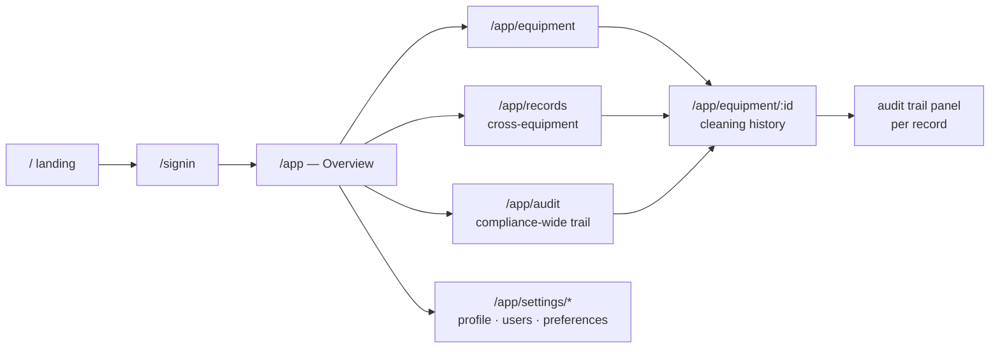

# Product flow

The workflow the system models, and the rules that constrain it.

---

## The core loop

The dashed edges are the point of the product. Nothing reaches the record without also reaching the
trail, and the trail is written in the same transaction as the change itself.

---

## Record lifecycle

A cleaning record has two states, and the transition between them is the only place a second person
is required.

Only a supervisor can move the status, in either direction. Amending a record's other fields does
not change its state, so it is not drawn as a transition — but it always writes an audit entry:

| Action | Who | Reason required? | Effect on the record |
|---|---|---|---|
| Record a cleaning | Operator | — | Starts `PENDING`; a client-supplied `status` is **ignored** |
| Amend a `PENDING` record | Operator | No | Audit entry only |
| Verify | **Supervisor**, never their own cleaning | No | Sets `verified_by_id` + `verified_at` |
| Amend a `VERIFIED` record | Supervisor | **Yes** | Audit entry only |
| Withdraw a sign-off | **Supervisor** | **Yes** | Clears `verified_by_id` + `verified_at` |

Nothing is destroyed by a transition. Withdrawing a sign-off clears the verification columns on the
*record*, and the trail keeps both the old values and the stated reason.

Three rules worth calling out, all enforced in the API rather than only in the UI:

- **A record always starts `PENDING`.** `status` is not accepted on create. Letting the author
  declare their own work verified would defeat the two-person rule the field exists to express.
- **A supervisor cannot verify a cleaning they performed.** Segregation of duties. The button is
  hidden in that case *and* the endpoint refuses it, because a hidden button is a convenience, not a
  control.
- **Only a supervisor can move the status either way**, and any amendment to an
  already-`VERIFIED` record — including withdrawing the sign-off — requires a stated `reason`,
  which is stored on the audit entry rather than on the record.

---

## Who can do what

There is deliberately **no signup route**. Accounts are provisioned by a supervisor, because
self-registration would let anyone mint the identity that then appears in the trail's *who* column —
which undermines the one property the system exists to provide.

---

## Screen navigation

The navigation mirrors the data model on purpose: equipment → its cleanings → one cleaning → its
history. The Records and Audit pages are the cross-cutting views that a per-asset drill-down cannot
answer — *"every CIP cleaning last week"* and *"everything Priya changed in March"*.
