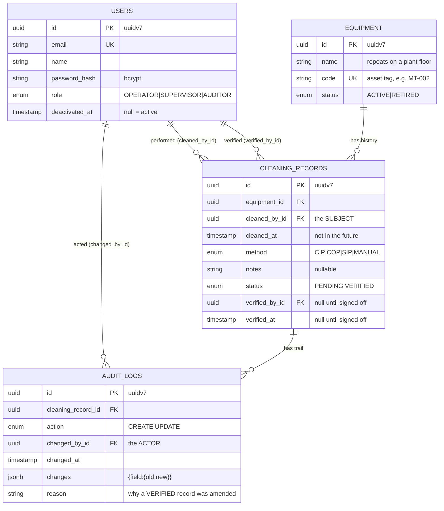
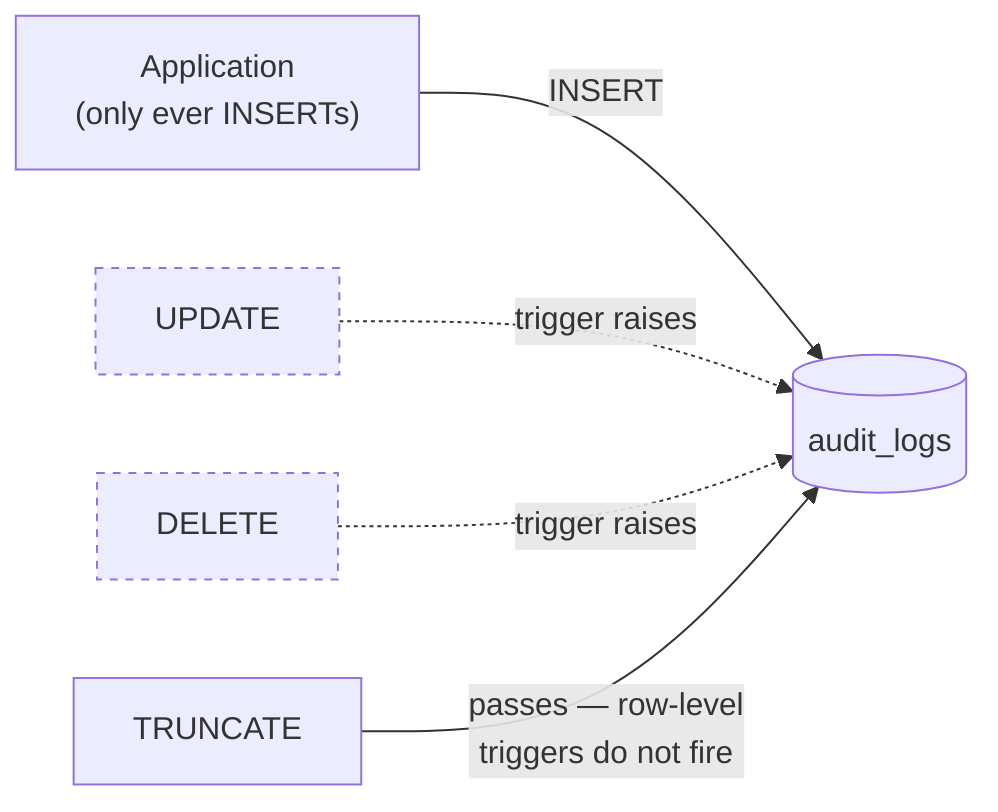

# Database design

PostgreSQL 17 (the deployed demo runs on Neon's 18). Schema in
[`apps/api/prisma/schema.prisma`](../apps/api/prisma/schema.prisma).

---

## Entity relationships

**The two-arrow relationship between `USERS` and `CLEANING_RECORDS` is deliberate.** A record names
who *performed* the cleaning and, separately, who *signed it off* — and neither is the same as the
person who edited the row, which is `audit_logs.changed_by_id`.

---

## The decisions behind it

### `cleaned_by_id` (subject) is not `changed_by_id` (actor)

The brief's `cleanedBy` conflates two people. An operator can file a record for a cleaning a
colleague performed; a supervisor can fix a typo on someone else's record. A regulator cares about
both and about telling them apart.

`cleaned_by_id` is chosen in the form and is itself an audited field. `changed_by_id` is *only ever*
taken from the verified JWT — there is no code path that lets a request body nominate it, and a test
sends one to prove it is ignored.

### `changes` is JSONB, not a column per field

Different updates touch different fields. The alternative —
`old_status`/`new_status`/`old_notes`/`new_notes`/… — needs a migration every time the record gains a
field, and leaves most columns null on most rows.

The cost: the trail is not statically typed at the database level, and *"show me every status
transition"* needs a JSON operator instead of a plain column. That is the right trade — PostgreSQL
indexes JSONB perfectly well if that query ever matters, and the schema stays stable as the domain
grows. Values are normalised to JSON scalars (dates to ISO strings, `undefined` to `null`) before
storage.

### UUIDv7 primary keys

Time-sortable, so `(cleaned_at, id)` is a usable total order for keyset pagination, while ids stay
opaque in URLs. Auto-increment integers would leak how many records exist and make ids guessable;
UUIDv4 would give up the sortable tie-breaker.

### `onDelete: Restrict` everywhere — no cascades

Deleting equipment must not silently take its cleaning history; deleting a record must not take its
audit trail. Cascades are convenient and exactly wrong here. Users are **deactivated**, not deleted,
for the same reason: their id is referenced by rows whose subject must not disappear.

### snake_case tables, camelCase in code

`@@map`/`@map` throughout. It keeps the hand-written SQL — the immutability trigger, the test
truncation — free of quoted identifiers. `"AuditLog"` needs quotes everywhere; `audit_logs` does not.

---

## Indexes, and what each is for

| Index | Serves |
|---|---|
| `cleaning_records (equipment_id, cleaned_at DESC, id DESC)` | The default ordering **and** the keyset seek. Both columns must be `DESC` to match the query. |
| `cleaning_records (equipment_id, status)` | The `?status=` filter within an asset's history. |
| `audit_logs (cleaning_record_id, changed_at DESC)` | A record's trail, newest first. |
| `equipment (status)` | Active/retired filtering. |
| `users (email)` unique | Login lookup. |

> **Honest caveat:** at ~70 seeded rows the planner will sequential-scan regardless, so the composite
> index is right *in principle* but unproven in practice. Verifying it with `EXPLAIN ANALYZE` at a
> few hundred thousand rows is on the list in NOTES.md.

---

## Immutability is enforced by the database

A trigger on `audit_logs` raises on `UPDATE` and `DELETE`
([migration](../apps/api/prisma/migrations)). The application never issues either — but *"the
application does not do that"* is a convention, and conventions do not survive a future developer, a
migration script, or somebody at a `psql` prompt. In a regulated context the guarantee belongs where
it cannot be bypassed.

**Deliberate gap:** `TRUNCATE` still works, because it does not fire row-level triggers and both the
seed and the test suite need to reset the database. It requires table ownership, so it stays an
administrative act rather than something application code can reach. The stronger answer — and the
next step — is for the application to connect as a role with `INSERT`/`SELECT` on `audit_logs` and
nothing more.
