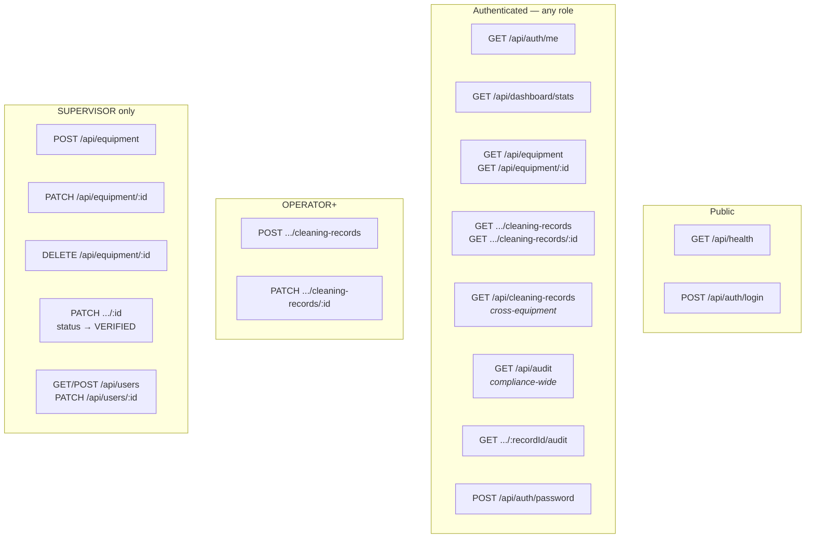
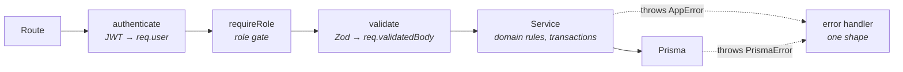
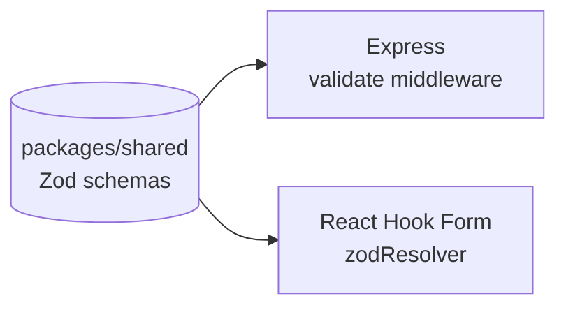

# API contract

Full endpoint reference with examples is in the [README](../README.md#api-reference). This is the
shape of the contract and the reasoning behind it.

---

## Design sketch


The original hand-drawn contract. Every route on it is real and unchanged, but it covers the core
CRUD surface only — the implementation adds:

- **Auth** — `POST /api/auth/login`, `GET /api/auth/me`, `POST /api/auth/password`
- **Cross-equipment reads** — `GET /api/cleaning-records` and `GET /api/audit`, the two flat routes
  that answer what a per-asset drill-down structurally cannot
- **Account provisioning** — `GET`/`POST /api/users`, `PATCH /api/users/:id` (supervisor only)
- **`GET /api/dashboard/stats`** and **`GET /api/health`**
- **Keyset params** — `?mode=cursor&cursor=…` alongside the `?page=&limit=&status=` on the sketch

One reading note: the sketch's *Audit* box wraps one path across three lines. It is a single nested
route — `GET /api/equipment/:equipmentId/cleaning-records/:recordId/audit` — not three.

---

## Surface



---

## Nested where the relationship is real

```
/api/equipment/:equipmentId/cleaning-records/:recordId/audit
```

A cleaning record has no meaning detached from the asset it describes, so the route says so. The
handler verifies the record actually belongs to that equipment and returns `404` otherwise — a
record cannot be read through the wrong parent.

The two **flat** routes exist because they answer questions a per-asset drill-down structurally
cannot:

| Route | The question |
|---|---|
| `GET /api/cleaning-records` | "Every CIP cleaning last week, across all assets" |
| `GET /api/audit` | "Everything Priya changed, everywhere" |

---

## One error shape, always

Every failure leaves through a single error handler:

```jsonc
{
  "error": {
    "code": "VALIDATION_ERROR",   // UNAUTHORIZED | FORBIDDEN | NOT_FOUND
                                  // CONFLICT | WRITE_CONFLICT | INTERNAL_ERROR
    "message": "Request body is invalid",
    "details": [
      { "path": "cleanedAt", "message": "Cleaning cannot be recorded in the future" }
    ]
  }
}
```

The client has exactly one branch to write. `details` is per-field so a form can highlight the
offending input rather than showing a detached banner.

Prisma's error codes are mapped to domain errors so a database-shaped failure never reaches the
client:

| Prisma | HTTP | Meaning |
|---|---|---|
| `P2002` | `409 CONFLICT` | Unique violation (e.g. duplicate asset code) |
| `P2025` | `404 NOT_FOUND` | Row not found |
| `P2003` | `409 CONFLICT` | FK violation (e.g. deleting equipment with history) |
| `P2034` | `409 WRITE_CONFLICT` | Serialization failure — the client may retry |

> Extracting the conflicting field from `P2002` needs care on Prisma 7: with a driver adapter the old
> `meta.target` is gone and the PostgreSQL constraint name arrives instead, so both shapes are
> handled.

---

## Pagination, two modes

```jsonc
// offset (default) — the UI needs page numbers and a total
{
  "data": [ /* … */ ],
  "pagination": {
    "mode": "offset", "page": 1, "limit": 10, "total": 28,
    "totalPages": 3, "hasNextPage": true, "hasPreviousPage": false
  }
}

// keyset — stable under concurrent inserts, no total
{
  "data": [ /* … */ ],
  "pagination": { "mode": "cursor", "limit": 10, "nextCursor": "eyJ…", "hasNextPage": true }
}
```

`limit` is **clamped** to 100 rather than rejected — a client asking for 10 000 gets 100, not an
error it has to handle. The cursor is base64url of `{ cleanedAt, id }`, unsigned (it encodes only
values already visible in the response, so signing would protect nothing) but schema-validated on
the way in, so a tampered cursor yields `400` rather than a crash.

---

## Request lifecycle



Layering is strict: **Express `req`/`res` types never enter a service.** Services take plain
arguments and return plain data, which is what makes the audit and pagination logic testable without
constructing an HTTP request.

Validated input goes on `req.validatedBody` / `req.validatedQuery`, never back onto `req.body` or
`req.query` — Express 5 makes `query` getter-only. Express 5 also forwards rejected promises to the
error handler automatically, which is why no route in the codebase wraps itself in `try/catch`.

---

## Shared validation



One definition of *"a valid cleaning record"*, including the "not in the future" rule, imported by
both apps. The server stays authoritative — the shared schema exists to stop the client and server
contracts drifting, not to move trust to the client.
