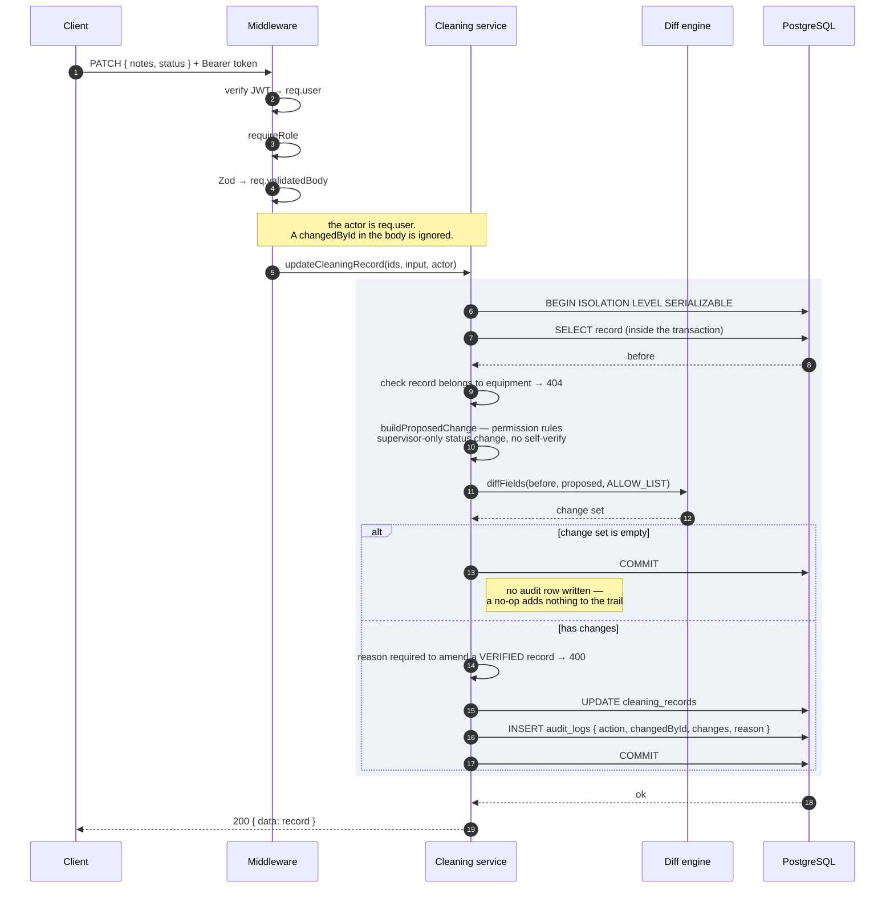
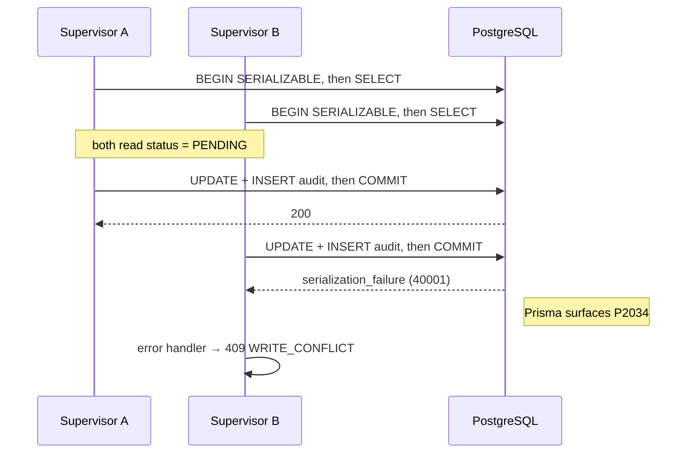
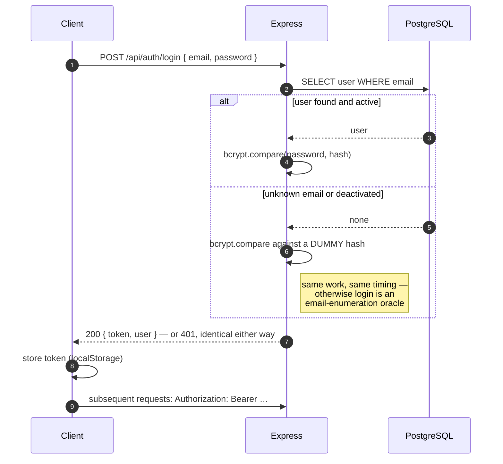
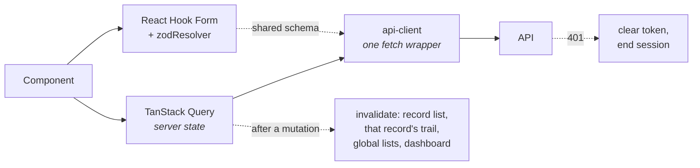

# Request / response flow

Three flows worth drawing: the audited write (the one the whole system exists for), sign-in, and
what happens when two people edit the same record at once.

---

## Design sketch

The hand-drawn flow, and it matches the implementation: the transaction opens **first**, the prior
state is read inside it at `SERIALIZABLE`, the diff runs, the record update and audit insert land
together, and a failing audit insert rolls the whole thing back leaving the record unchanged.

The only thing it leaves implicit is the middleware — authentication, the role gate and Zod
validation all run before the service reaches the transaction, and the actor written to the audit
entry comes from there, never from the request body. The sequence below shows that step.

---

## The audited write

`PATCH /api/equipment/:equipmentId/cleaning-records/:recordId`

**Why the `SELECT` is inside the transaction, at `SERIALIZABLE`.** Under the default
`READ COMMITTED`, two concurrent `PATCH`es could each read the same `before` row and each write an
audit entry claiming the same old value. Nothing would error. The record would end up correct and the
trail would be quietly, plausibly wrong — the worst possible outcome for this system.

**Why one transaction.** If the audit insert fails, the record update must fail too. A change that
lands without a trail entry is an untraceable change. There is an integration test that installs a
temporary trigger to force the audit insert to throw, then asserts the record is unchanged.

---

## Write conflict

What the isolation level buys, and what it costs:

Without this, B's audit entry would claim `PENDING → VERIFIED` when A had already made that
transition — a second entry asserting a stale old value.

The cost is real: reduced write throughput and retryable failures for concurrent edits of the *same*
record. For a cleaning log — a handful of writes per record, ever — that is free. **With more time**
the API should retry `P2034` itself once or twice with a short backoff before surfacing the 409;
right now the burden is on the client.

---

## Sign-in

An unknown email and a wrong password take the same time and return an identical response. The
identity on later requests is reconstructed from the token's claims rather than re-read from the
database — stateless and cheap, at the cost that a role change does not take effect until the token
expires (8h).

---

## Front-end data flow

Two things learned the hard way and documented in NOTES.md: a mutation must invalidate the *global*
lists and the dashboard as well as the per-asset ones (otherwise verifying a record leaves three
views showing the pre-write value), and a `401` has to end the session centrally — otherwise an
expired token turns every page into a permanent error state with no way out.
